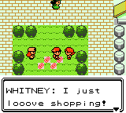
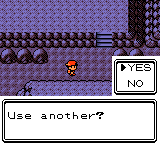
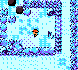
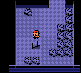
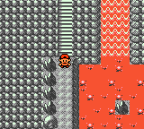
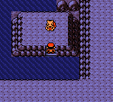
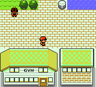
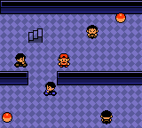
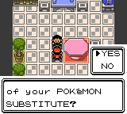

# Trainers
- Every trainer's team has been revised
- Most trainer classes have better DVs
- Most trainers have better AI; they will now switch and use items
- Many trainers' teams have custom movesets and held items
- Over 100 new trainers, mostly in Kanto
- A more linear level curve, with the Elite Four at lv 60-70 and Red at lv 100
- After opening Mt. Silver, all gym leaders and the Elite Four can be rebattled with stronger teams

# Quality of Life Improvements
- Saving is now instant
- Hold B to run
- New text speed option: instant
- Kurt makes Pokeballs instantly
- Repels can be used continuously without going into menu
- Simply press down, B, select simultaneously at the title screen to reset the clock
- Lucky Number Game is now daily instead of weekly
- Numerous bug fixes

# New Maps
- Viridian Forest
- Seafoam Islands
- Power Plant Ruins
- Cinnabar Volcano
- Safari Zone
- Underground Path
- Cerulean Cave
- Pewter Museum
- Silph Co. 2nd Floor
- Cerulean City Bike Shop
- See [NEWMAPS.md](NEWMAPS.md) for images

# Pokemon
- All 251 Pokemon obtainable in single playthrough
- New stationary encounters for Kanto legendaries
- Kanto trade evos now evolve by level
- Johto trade held item evos now evolve when the item is used on them. Items still have held effect
- Pokemon can be revived from fossils

# Aesthetic Improvements
- Pokemon menu icon colors now match the Pokemon's palette
- 3rd trainer card page for Kanto badges
- Kanto city roofs are all the city's color

# New Events
- Warden's granddaughter sneaks you into Safari Zone
- Kanto Pokemon Federation takes over rt 7-8 Underground Path
- Each gym leader can rebattled in places they like to hang out on certain days of the week

# Moves
- Some slight updates to learnsets
- Sweet Scent, Detect, and Swagger TMs are replaced by Ice Beam, Thunderbolt, and Flamethrower
- Goldenrod move tutor now teaches Spikes, Rock Slide, and Swords Dance
- New move tutors for Sweet Scent, Softboiled, Substitute, and Explosion

# Not Changed
- No new moves or Pokemon
- Special/Physical mapped to type
- The story is unchanged
- TMs are single-use