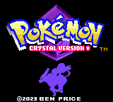

# Pokemon Crystal Version *
By Ben Price

Features:

- Balanced, though challenging difficulty curve
- All 251 Pokemon obtainable
- Vastly expanded Kanto region
- Numerous quality-of-life improvements
- Elite four, gym leaders, and Red rematches
- 100+ new trainers
- New move tutor moves
- No significant story or mechanics changes
- See [CHANGES.md](CHANGES.md) for more

How to play:
- Download the latest release and load into your favorite GBC emulator
- Or, compile the source code yourself, see [POKECRYSTAL.md](POKECRYSTAL.md) for details

Issues:
- Cave entrances no longer flicker, except dark palette

Credits:
- Based heavily on pret's pokecrystal disassembly and its tutorials
- Utilized Rangi42's Polished Map for map/tileset editing
- Additional Pokemon overwold sprites by LuigiTKO
- Running sprites by Tom Wang and Seasick
  
